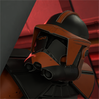

# Welcome to MrClock's documentations

!!! Notice

	This documentation is in active development.

## About the author

Been modding [Arma 3](https://store.steampowered.com/app/107410/Arma_3/) since early 2018.
Tried hands at many areas of modding including modelling, texturing, importing various assets and scripting, with extensive experience regarding full production of character equipment (uniforms, vests, weapons etc.), and intermediate experience in vehicle production among other things.
Studying civil engineering, doing drawing, modding and programming as personal hobbies.

Usually available through [Steam](https://steamcommunity.com/id/MrClock8163/), or on discord as `MrClock#8163`.

## About the projects

The projects listed here are mostly tools to assist in mod development for Arma 3. Almost all of these tools started out as relatively simple scripting projects to automate tedious, or error prone tasks,
but they were eventually turned into full desktop applications for the sake of learning, and experimenting with new things.

The tools are not general solutions like the [Arma 3 Tools](https://store.steampowered.com/app/233800/Arma_3_Tools/), or [Mikero's tools](https://mikero.bytex.digital/), they usually serve niche purposes, spawned from personal comfort requirements, and may depend on other third party assets.

!!! disclaimer

	As programming is a hobby, the used techniques may not be the most professional, or most efficient. While performance and efficiency was of course considered where necessary,
	the primary goal is for the tools to work, and work reliably, not to look good in source code.

!!! danger "Warning"

	The tools are not widely tested on computers, they may not run correctly on any machine. Use them at your own discretion, and report any issues you encounter in those that are still maintained.

## Download

!!! note

	Not all iterations of the same tool concept may be available for download.

The tools can be downloaded from the [GitHub](https://github.com/MrClock8163/ToolsArchive) tools archive.
The different tools are grouped by the environment they were written in.

These include:

* Python 3.8 with appJar UI library
* Visual Basic .Net 5.0 with Windows Forms UI
* Visual Basic .Net Framework 4.8 with WPF UI