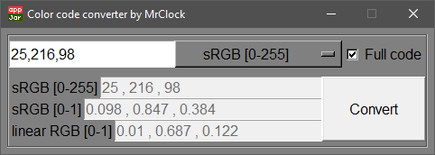

# Color converter

!!! warning "Outdated"

	This tool is no longer maintained.
	
!!! note
	
	This page is about the **Python** version of the tool. If you want to read about the Visual Basic based iteration, head over to the [Color converter (VB.Net)](../vbnet/colorconverter.md) page.

## Features

* Convert between color formats

	* sRGB 8-bit
	* sRGB
	* linear RGB

* Convert just one value or an RGB triplet

Many modders use Substance Painter coupled with other image editiong programs for texturing 3D models.
Issues arise however when one tries to transfer the color values between them.
While Photoshop for example uses sRGB colors in 8-bit representation (values: 0-255), and the procedural texture macros of Arma 3 also use sRGB but in floating point format
(values: 0.0-1.0), Substance Painter uses a different color format.
To allow for quick conversion between these values, the **Color converter** was written.

## Environment

* Logic:  Python 3.8
* GUI:    appJar library

## Requirements

* Python 3.8