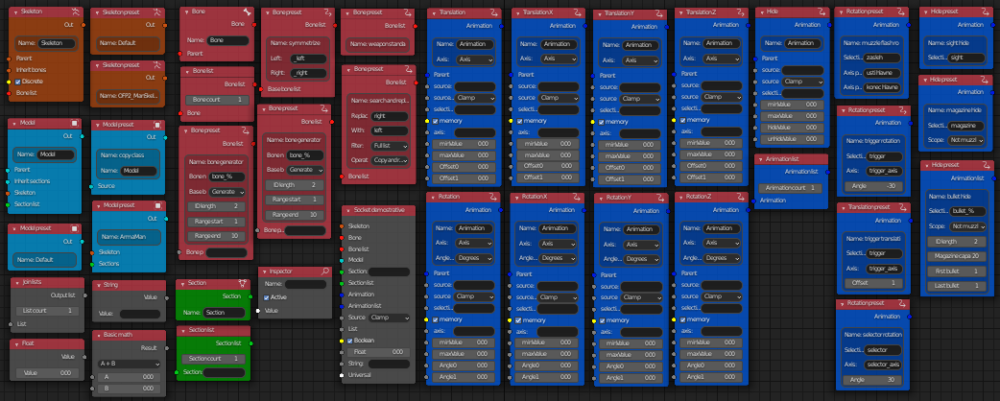

# Model config editor

!!! note

	This is a short summary. The complete documentation and code base can viewed in the [GitHub repository](https://github.com/MrClock8163/BlenderModelCfgEditor) of the project.

In Arma 3, complex model assets require a `model.cfg` to work properly.
This config file contains the skeleton definition, selection and coded animation definitions associated with the asset.

The creation of model config files by hand is very repetitive, and prone to mistakes like typos, or forgetting necessary properties.

The Model config editor is a node based Blender addon designed to aid in the creation of these files.

## Features

* Visual representation of configuration setups
	* Generic nodes for configurations
	* Preset nodes for freqently needed components
	* Custom scripted nodes for special cases
* Creation of sections and bones from existing model selections
* Raw node data inspection
* Node setup presets
	* Built-in
	* Custom
* Output validation
* Import from model.cfg format
* Export to model.cfg format
* Ability to store setup data in editable format in BLEND file

## How it works

This Blender addon introduces an entirely new node editor workplace to Blender called Model Config Editor. This interface makes it possible to create model.cfg setups through a node-based workflow.
The classes and properties (eg.: skeletons, model, animations etc.) of a traditional model configuration file are represented by a variety of nodes, node settings.
The available nodes beside the basic ones also include some handy preset generators for frequently needed operations (such as a bone structure symmetrizer), different animation generators, standard Arma 3 skeleton and model presets (eg.: for OFP2_ManSkeleton and ArmaMan) and much more.

Once the setup is completed, the structure can be validated and exported to the selected folder. During export, the nodes are processed and the result is printed out into the appropriate file.

!!! note
	
	While this project seeks to eliminate the need for manual (as in typing it by hand) creation of model.cfg files, knowledge of their structure, capabilities and limitaions is still necessary to utilize this addon.
	Some basic (although granted, not at all thorough) information about them can be found on the [Arma 3 Community Wiki](https://community.bistudio.com/wiki/Model_Config).
	It is also worth noting that the main purpose of this addon is to speed up the creation of relatively simple configurations, complex configs will still take a long time (so do not expect this addon to be the Messiah, the solver of all problems).

## Environment

* Python
* Blender Python API

## Requirements

* Blender (v2.83.0 or higher)