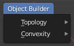

# Object Builder utilities

This small addon aims to bring some of the useful utility functions of the Arma 3 Object Builder to Blender, in order to complement the [ArmaToolbox](https://github.com/AlwarrenSidh/ArmAToolbox) addon by Alwarren. 

## Functions

The features only work on single selected mesh entites, and are available from both Edit and Object modes of the viewport.

### TOPOLOGY

#### Find Non-Closed

Find edges that are boundary to a face, and do not have a second face connecting, as well as loose edges without any faces connected.

#### Find Components

The function loops through all disconnected mesh sections in the selected object, and generates `ComponentXX` format vertex groups.

The function is intended to be used to create the component selections for Geometry type LODs

!!! note

	The disconnected pieces are not checked whether or not they are valid pieces of geometry, or just loose wire edges.
	Make sure to only use the function on clean geometry!

### CONVEXITY

#### Find Non-Convexities

Mark edges that join two faces in a non-convex way (the interior angle between the faces is greater than 180 degrees).

!!! note

	Due to the numerical errors in nearly-flat connections inherent to floating point calculations, the convexity check is only done above a built-in threshold which may differ from Object Builder.
	Always run the function in Object Builder as well before packing the PBOs to double check!

#### Convex Hull

Calculates convex hull for the whole selected object.

#### Component Convex Hull
	
This function is a combination of the **Find components** and **Convex Hull** functions.

The function loops through all disconnected mesh pieces, performs a convex hull operation on them, and generates `ComponentXX` format vertex groups.

## Environment

* Python
* Blender Python API

## Requirements

* Blender (v2.83.0 or higher)