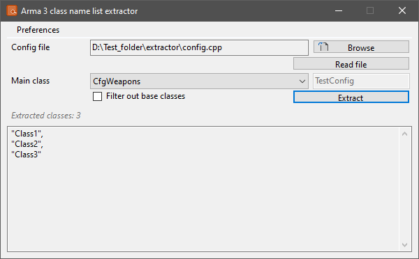
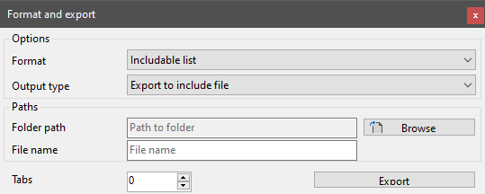

# Class list extractor

!!! warning "Outdated"

	This tool is no longer maintained.

!!! note
	
	This page is about the **Visual Basic .Net** version of the tool. If you want to read about the more recent Visual Basic .Net Framework based iteration, head over to the [Class list extractor (VB.Net Framework)](../vbnetframework/classextractor.md) page.

## Features

* Open **config.cpp** files
* Read the list of classes embedded in a base class
* Format the output

### Open and extract

The class list extractor allows to read an Arma 3 config.cpp file, and extract the list of sub-classes contained within a base class like `CfgWeapons` or `CfgVehicles`.

!!! tip

	The original purpose of the tool is to make it easy to gather the lists of class names needed for the `units` and `weapons` array of the `CfgPatches` class in a config.
	When a config is long enough, this task is rather long and tedious to do manually all the time.



The reading of the config.cpp is `regex` based and relies on the **CfgConvert.exe** of the **Arma 3 Tools** on steam to standardize the formatting of the file.
The program reads the entire file line by line, and converts it into an internal class structure, then extracts the names of classes contained in the selected base class.
The extracted names are displayed in the includable list format.

!!! caution

	Due to the complexity of the config.cpp syntax, the `regex` solution used is not entirely reliable. Some config files may fail even if they are completely valid.

!!! note

	By default, the program filters out all classes that are judged to be external class references.
	These classes are ones...
	
	* marked as external references in the config
	* that only contain external reference classes, and nothing else

### Format the output

After the extraction, it is possible to change the formatting of the output, and save it to a file, or copy it to the clipboard. The **Format and export** window can be accessed from the context menu of the output field.



#### Format options

* **Includable list**: the names are formatted as items in a config array, making it easy to paste them back into config if needed
``` cpp
"Item1",
"Item2",
"Item3",
...
"ItemX"
```

* **Plain list**: the names are not formatted on any specific way, only listed line by line
``` txt
Item1
Item2
Item3
...
ItemX
```

* **Class declarations**: the names are formatted as external base class references
``` cpp
class Item1;
class Item2;
class Item3;
...
class ItemX;
```

#### Output options

* **Copy to clipboard**: the formatted output is copied to the system clipboard
* **Export to include file**: the formatted output is saved to an `.hpp` file, with the specified name, in the selected directory

## Environment

* Logic:  Visual Basic .Net 5.0
* GUI:    Windows Forms

## Requirements

* .NET 5.0
* [Arma 3 Tools](https://store.steampowered.com/app/233800/Arma_3_Tools/)
