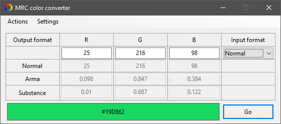
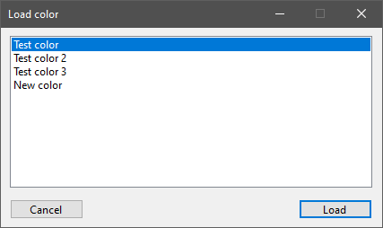

# Color converter

!!! warning "Outdated"

	This tool is no longer maintained.

!!! note
	
	This page is about the **Visual Basic .Net** version of the tool. If you want to read about the Python based iteration, head over to the [Color converter (Python)](../python/colorconverter.md) page.

## Features

* Convert between color formats

	* sRGB 8-bit
	* sRGB
	* linear RGB

* Preview the converted color
	
* Save and load colors from formatted .txt file

This Color converter is a rewrite of the original Color converter written in Python. This version is written in Visual Basic .Net, and can be ran from a compiled executable.

### Conversion

Improvements for this version include a UI that is easier to navigate, a color panel that allows to preview the converted color, and displays the HEX color code.

### Save colors

This version also makes it possible to save colors to a [formatted plain text file](../formats/libraryTXT.md), and load them back in when needed.

## Environment

* Logic:  Visual Basic .Net 5.0
* GUI:    Windows Forms

## Requirements

* .NET 5.0
