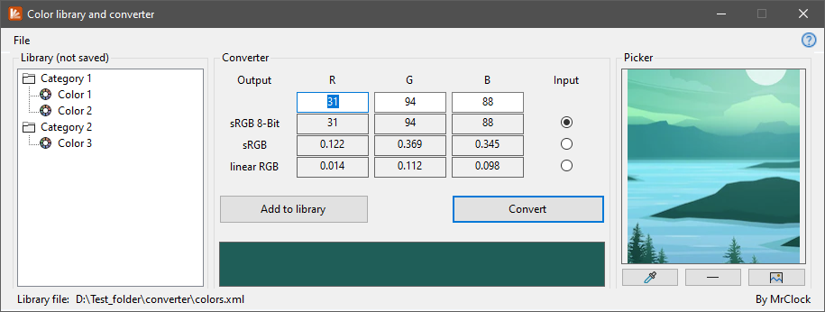
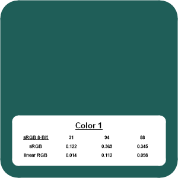

# Color library and converter

!!! warning "Outdated"

	This tool is no longer maintained.
	
!!! note
	
	This page is about the **Visual Basic .Net** version of the tool. If you want to read about the more up-to-date Visual Basic .Net Framework based iteration, head over to the [Color converter (VB.Net Framework)](../vbnetframework/colorlibrary.md) page.

## Features

* Convert between color formats

	* sRGB 8-bit
	* sRGB
	* linear RGB
	
* Save and load colors from formatted .xml file

* Generate color sample cards

* Pick color from loaded or copy-pasted images

The Color library and converter is the third iteration of the color converter tool. It is written in Visual Basic .Net. It integrates the converter part of the previous iteration
with a structured color library, which allows for categories as well, and a color picker window.

### Conversion



Before conversion, the value to be converted, and the format of the input value has to be set. If the input value in one of the RGB fields is invalid for the selected input format, the result fields are displayed empty after conversion.
If all 3 RGB values could be successfully converted, a color sample is displayed at the bottom of the window.

### Pick a color

The color picker area accepts existing images by drag-and-drop and opening through file explorer, as well as images pasted from the clipboard.

### Color library

The color library is stored in [XML files](../formats/libraryXML.md) with specific formatting:

``` xml
<?xml version="1.0" encoding="utf-8"?>
<color>
  <category>
	<name>Category 1</name>
	<color>
	  <name>Some color</name>
	  <format>3</format>
	  <R>0.353</R>
	  <G>0.101</G>
	  <B>0</B>
	</color>
  </category>
  <category>
	<name>Category 2</name>
  </category>
</color>
```

### Color cards

Color cards can be generated from colors saved in the current library. The main body of the card is of the selected color, and the annotation block contains the name and color codes.



The name of the color format in which the color is saved in the library is always underlined. This is to indicate which format is the most precise (while conversion is precise, ±0.001 deviation can sometimes be observed in the converted values due to rounding).

**Options:**

* **Annotation:**
	* **Name:**
		* **Library name:** include the library name of the color
		* **Custom name:** prompt for a custom name
	* **Color codes:**
		* **Source format:** include only the source format values
		* **All formats:** include all converted values
* **Export target:**
	* **To file:** save color card to file in PNG format (300 x 300 pixels, rounded corners)
	* **To clipboard:** copy color card to system clipboard (300 x 300 pixels, straight corners)

## Environment

* Logic:  Visual Basic .Net 5.0
* GUI:    Windows Forms

## Requirements

* .NET 5.0
