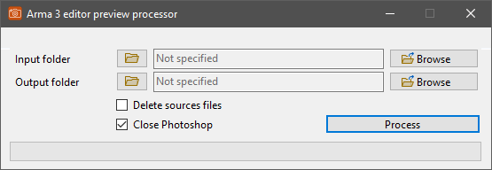

# Editor preview processor

!!! warning "Outdated"

	This tool is no longer maintained.

!!! note
	
	This page is about the **Visual Basic .Net** version of the tool. If you want to read about the Visual Basic .Net Framework based iteration, head over to the [Editor preview processor (VB.Net Framework)](../vbnetframework/editorpreviewprocessor.md) page.

## Features

* Automate resizing the editor preview images exported from game

To help mission makers, every asset available in the Asset browser of the 3DEN editor can have a preview image set. The preview images can be exported from game with the `BIS_fnc_exportEditorPreviews` built-in function.
The function saves screenshots of the assets according to the arguments it was called with. These screenshots are in same resolution as the game is running, and they need to be resized and saved to JPG format to be usable as preview images.
This task is not complex, but it becomes rather tedious when a mod has hundreds of assets. The goal of this tool is to automate and speed up this process.

More info can be found on the  [Bohemia Interactive community wiki](https://community.bistudio.com/wiki/Eden_Editor:_Configuring_Asset_Previews).

The program iterates through the PNG files in the specified input directory, resizes them, and saves them as JPG in the output directory with the same file name.

The resizing is done by programatically opening the images one by one in Photoshop, and resizing them.

After all the images are processed, if the options are checked, Photoshop is closed, and all the source images are deleted from the input folder.

## Environment

* Logic:  Visual Basic .Net 5.0
* GUI:    Windows Forms

## Requirements

!!! warning

	The tool was only tested with Photoshop CS6, it may not work correctly, or crash with other versions.

* .NET 5.0
* Photoshop