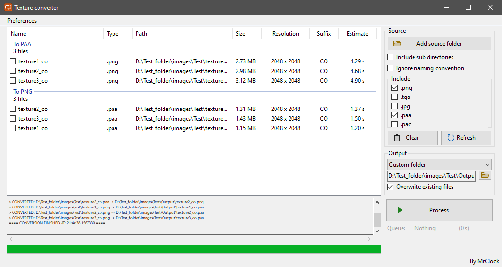
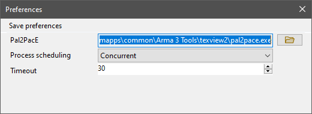

# Texture converter

!!! warning "Outdated"

	This tool is no longer maintained.

!!! note
	
	This page is about the **Visual Basic .Net** version of the tool. If you want to read about the more recent Visual Basic .Net Framework based iteration, head over to the [Texture converter (VB.Net Framework)](../vbnetframework/textureconverter.md) page.

## Features

* Convert images to PAA texture format
* Convert PAA to PNG format
* Do conversion in both directions simultaneously
* Run conversions concurrently

The [Arma 3 Tools](https://store.steampowered.com/app/233800/Arma_3_Tools/) have a very similar application called [ImageToPAA](https://community.bistudio.com/wiki/ImageToPAA). While ImageToPAA is a solid program, it only supports conversion to PAA, and not **from** PAA.
The Texture converter was mainly written to address this lack of feature. Otherwise it has a very similar interface and set of features.

### Loading files

The UI accepts files on 2 main ways:

* Add source folder button:
	* a folder can be selected, from which all contained files are loaded (subdirectories are scanned if the setting is enabled)
* Drag and drop:
	* multiple files and/or folders can be dropped onto the list view area
	
When files are loaded into the list to convert, only those files are considered that have one of the extensions enabled for inclusion.

#### Conversion list

The loaded files are displayed in a list view with a set of informative fields:

* **Name:** file name without extension
* **Type:** file extension
* **Path:** full path to the file
* **Size:** file size on disk
* **Resolution:** texture resolution (resolution of the 1st mipmap in case of PAA)
* **Suffix:** texture type indicator suffix (eg: `CO`, `CA`, `NOHQ` etc.)
* **Estimate:** estimated time necessary for conversion

!!! note

	The estimated conversion time is based on the file size being divided by an approximate bytes/seconds conversion speed derived from tests during development, therefore it is only an informative value, the true time may differ.

#### File validation

Each file is ran through a rudimentary validation. Validation exists to make sure that files are actually in the supported formats, the pixel formats are acceptable by the converter, and the file names conform to the naming conventions.

If a file fails at one point in the validation, an entry is added to the log area with information, and the file is not enabled for conversion by default (it is still possible to force it through manually, in case the validation produced a false negative for some reason).

### Conversion

The actual image conversion is done by the **Pal2PacE.exe** of the **Arma 3 Tools**, so the program makes calls to that executable either one by one, or in a concurrent batch, according to the preferences.

The converted files are either placed back into the source folder, or into a custom output folder.

If a file could not be converted, an error message is added to the log.

## Preferences

* **Pal2PacE:** path to the Pal2PacE executable (the program attempts to locate it automatically through registry at the first run)
* **Process scheduling:**
	* **Progressive:** textures are converted one at a time, process can be stopped, relatively slow, but easy on memory
	* **Concurrent:** textures are converted in a batch, the process cannot be stopped, considerably faster with high file count, but harder on memory usage
* **Timeout:** timeout threshold for conversion processes in seconds

!!! warning

	The concurrent conversion effectively calls the Pal2PacE executable as many times simultaneously as many files are to be converted. This can eat up memory resources very quickly with large file quantities. Use with caution!

## Environment

* Logic:  Visual Basic .Net 5.0
* GUI:    Windows Forms

## Requirements

* .NET 5.0
* [Arma 3 Tools](https://store.steampowered.com/app/233800/Arma_3_Tools/)
