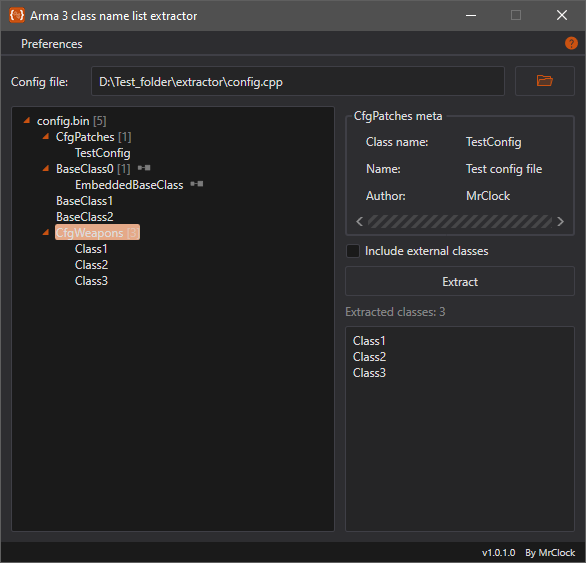
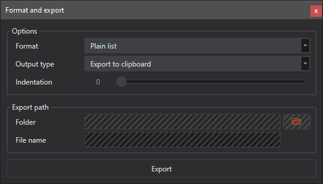

# Class list extractor

!!! note
	
	This page is about the latest **Visual Basic .Net Framework** version of the tool. If you want to read about the older Visual Basic .Net based iteration, head over to the [Class list extractor (VB.Net)](../vbnet/classextractor.md) page.
	

## Features

* Open **config.bin** and **config.cpp** files
* Display entire class structure of the config
* Extract the list of embedded classes from any class
* Format the output
* Dark and light color theme

### Open and extract

The class list extractor allows to read an Arma 3 config file, and extract the list of sub-classes from any contained class.

!!! tip

	The original purpose of the tool is to make it easy to gather the lists of class names needed for the `units` and `weapons` array of the `CfgPatches` class in a config.
	When a config is long enough, this task is rather long and tedious to do manually all the time.
	
	This version however evolved into a more general solution.



!!! tip
	
	The program accepts config files by drag-and-dropping onto the tree view panel as well.

Contrary to the original iteration of this tool, in this version, the config is read from binary format instead of plain text.
This means that the entire contained class structure can be reliably read and displayed.
If the selected file is a config.cpp, the file is first converted to binary format by the **CfgConvert.exe** of the **Arma 3 Tools**.
The binary config file is then deserialized according to the specifications of the **raP** format, found on the [Bohemia Interactive community wiki](https://community.bistudio.com/wiki/raP_File_Format_-_Elite).

!!! note

	If a file cannot be loaded, either the selected **config.bin** is faulty, or the **config.cpp** had syntax errors that the **CfgConvert.exe** could not let pass.

If the selected file could be loaded without errors, the entire contained class structure is displayed in a tree hierarchy with markers about the number of embedded classes in each class, and if a class is an external reference, or is marked for deletion.
After selecting a class in the hierarchy, the names of the contained sub-classes can be extracted to a list. The list is displayed in the output area, in plain format.

!!! note

	By default, the program filters out all classes that are judged to be external class references.
	These classes are ones...
	
	* marked as external references in the config
	* that only contain external reference classes, and nothing else

### Format the output

Just like in the original version, after the extraction, it is possible to change the formatting of the output, and save it to a file, or copy it to the clipboard. The **Format and export** window can be accessed from the context menu of the output field.



#### Format options

* **Plain list**: the names are not formatted on any specific way, only listed line by line
``` txt
Item1
Item2
Item3
...
ItemX
```

* **Array item list**: the names are formatted as items in a config array, making it easy to paste them back into config if needed
``` cpp
"Item1",
"Item2",
"Item3",
...
"ItemX"
```


* **Base class defintions**: the names are formatted as external base class references
``` cpp
class Item1;
class Item2;
class Item3;
...
class ItemX;
```

#### Output type options

* **Export to clipboard**: the formatted output is copied to the system clipboard
* **Export to include file**: the formatted output is saved to an `.hpp` file, with the specified name, in the selected directory

## Environment

* Logic:  Visual Basic .Net Framework 4.8
* GUI:    Windows Presentation Foundation

## Requirements

* .NET Framework 4.8
* [Arma 3 Tools](https://store.steampowered.com/app/233800/Arma_3_Tools/)
