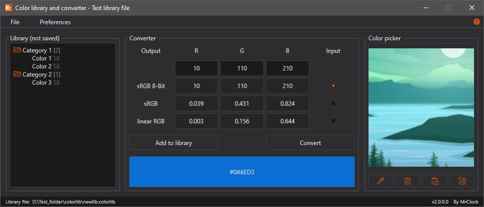
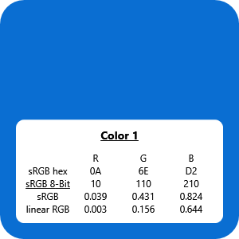
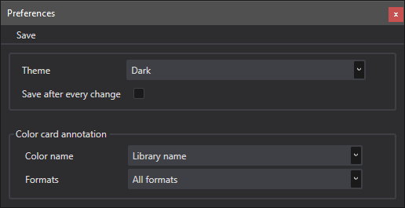

# Color library and converter

!!! note
	
	This page is about the latest **Visual Basic .Net Framework** version of the tool. If you want to read about thee Visual Basic .Net based iteration, head over to the [Color converter (VB.Net)](../vbnet/colorlibrary.md) page.

## Features

* Convert between color formats

	* sRGB 8-bit
	* sRGB
	* linear RGB
	
* Save and load colors from color library file

* Generate color sample cards

* Pick color from loaded or copy-pasted images

* Supports light and dark theme

The Color library and converter is the fourth iteration of the color converter tool, and the second iteration of the integrated color library.
It is written in Visual Basic .Net Framework. It integrates the converter part of the original iteration
with a structured color library which allows for categories as well, and a color picker window.

### Conversion

Before conversion, the value to be converted, and the format of the input value has to be set. If the input value in one of the RGB fields is invalid for the selected input format, the result fields are displayed empty after conversion (visual feedback is also given while the input is typed into the fields).
If all 3 RGB values could be successfully converted, a color sample is displayed at the bottom of the window, and the sRGB hexadecimal code is also shown (the feature was brought back from the second color converter iteration).

### Pick a color

The color picker area accepts existing images by drag-and-drop and opening through file explorer, as well as images pasted from the clipboard.

### Color library

The color library is stored in a special [COLORLIB file](../formats/colorlib.md) which is easier to manage programatically and validate for integrity.

Colors are stored in categories. All items in the hierarchy are displayed in alphabetical order (even if they are not like so in the actual library file).

Next to every category, the number of contained colors is displayed, while next to every color, the saved format is indicated (`S8`: sRGB 8-bit, `S`: sRGB, `L`: linear RGB).

### Color cards

Color cards can be generated from colors saved in the current library. The main body of the card is of the selected color, and the annotation block contains the name and color codes.

The name of the color format in which the color is saved in the library is always underlined. This is to indicate which format is the most precise (while conversion is precise, ±0.001 deviation can sometimes be observed in the converted values due to rounding).

## Preferences

### Save after every change

If this setting is enabled, the library is saved (if possible) after every change made to it (eg: renaming the library, adding or removing items etc.).

!!! warning

	Use with caution! With this setting, if something is changed, it is changed permanently, and there is no undo.
	
### Color card annotation

* **Color name:**
	* **Library name:** include the library name of the color
	* **Custom name:** ask for custom name
* **Formats:**
	* **Only source format:** include only the source format values
	* **All formats:** include all converted values

## Environment

* Logic:  Visual Basic .Net Framework 4.8
* GUI:    Windows Presentation Foundation

## Requirements

* .NET Framework 4.8
