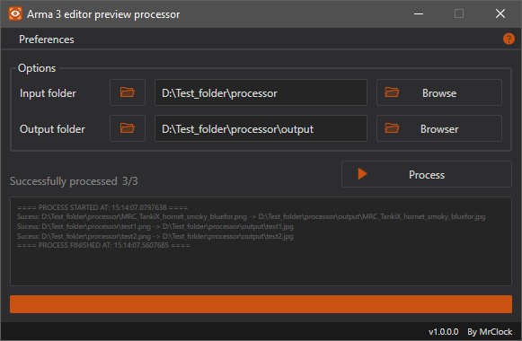

# Editor preview processor

!!! note
	
	This page is about the latest **Visual Basic .Net Framework** version of the tool. If you want to read about the Visual Basic .Net based iteration, head over to the [Editor preview processor (VB.Net)](../vbnet/editorpreviewprocessor.md) page.

## Features

* Automate resizing the editor preview images exported from game
* Light and dark color theme

This is the second iteration of the Editor preview processor. The program automates the resizing and saving of the images in JPG format.

More info can be found on the  [Bohemia Interactive community wiki](https://community.bistudio.com/wiki/Eden_Editor:_Configuring_Asset_Previews).



The program iterates through the PNG files in the specified input directory, resizes them, and saves them as JPG in the output directory with the same file name.

The main improvement over the first iteration is that, this version does not rely on Photoshop, the resizing is done purely through .Net Framework functions. As such, it is considerably faster, since the files do not have to be loaded one by one into the Photoshop UI.

After all the images are processed, if the option is enabled, the source files are ereased from the input folder.

## Environment

* Logic:  Visual Basic .Net Framework 4.8
* GUI:    Windows Presentation Foundation

## Requirements

* .NET Framework 4.8

## Changelog

??? changelog "v1.0.0"

	```text
	Initial public version
	```
