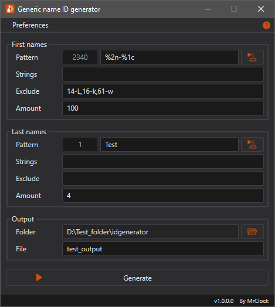

# Generic name ID generator

## Features

* Generate randomized ID number like strings from patterns
* Save output for inclusion in config
* Light and dark color theme

In Arma 3, the NPCs have randomized names. These names are drawn from the `GenericName` class specified in the config of the particular NPC.
The base config of the game contains a great assortment of human names which are more than enough for most cases. But what if a mod wanted to have ID numbers as names for the AI?
Typing out 50-100 random "first names" and "last names" manually can be very tedious.

!!! info

	The generic name classes are defined in the `CfgWorlds >> GenericNames` class.

The purpose of this tool is to make it simple to generate ID-like generic name definitions for NPC names. The name strings are generated based on the patterns provided, in the set quantity if possible.

The original version was written in Python, and offered only a very basic numeric generator functionality.



### Patterns

During the generation process, the program takes the pattern string, and replaces the placeholders with random data according to the specifiers. The pattern sytanx supports 4 types of randomized data.

The number of possible unique combinations with the specified pattern is displayed next to the input field.

#### Numbers

**Syntax:** `%<format>n`

**Format:** 1 or 2 numeric digits

* 1 digit (any number 1-9): number of digits the random number should have
* 2 digits:
	* 1st digit (must be 0): indicates that leading zeros should be added
	* 2nd digit (any number 1-9): number of digits including the leading zeros
	
**Examples:**

* `%3n` -> `324`
* `%03n` -> `024`

#### Characters

**Syntax:** `%<format>c`

**Format:** 1 numeric digit

* 1 digit (any number 1-9): number of random characters to generate in sequence
	
**Examples:**

* `%3c` -> `AXV`

#### Mixed

**Syntax:** `%<format>m`

**Format:** 1 numeric digit

* 1 digit (any number 1-9): number of random characters and digits to generate in sequence
	
**Examples:**

* `%3m` -> `X1P`

#### Strings

**Syntax:** `%s`

**Format:** no format specifier, a random string is selected from the list set in the appropriate input field
	
**Examples:**

String list: `QWERTY,QWERTZ,123`

* `%s` -> `QWERTZ`

### Output

The generated names are formatted for inclusion in a config file.

*test_output.hpp:*
``` cpp
class FirstNames {
	Item_82Q = "82-Q";
	Item_53V = "53-V";
	Item_11F = "11-F";
	Item_83I = "83-I";
	Item_74I = "74-I";
	...
};
class LastNames {
	Test = "Test";
};
```

Inclusion in config:
``` cpp
class CfgPatches {
	class CustomAddon {
		...
	};
};

class CfgWorlds {
	class GenericNames {
		class CustomGenericNames {
			#include "test_output.hpp"
		};
	};
};

...
```

## Environment

* Logic:  Visual Basic .Net Framework 4.8
* GUI:    Windows Presentation Foundation

## Requirements

* .NET Framework 4.8